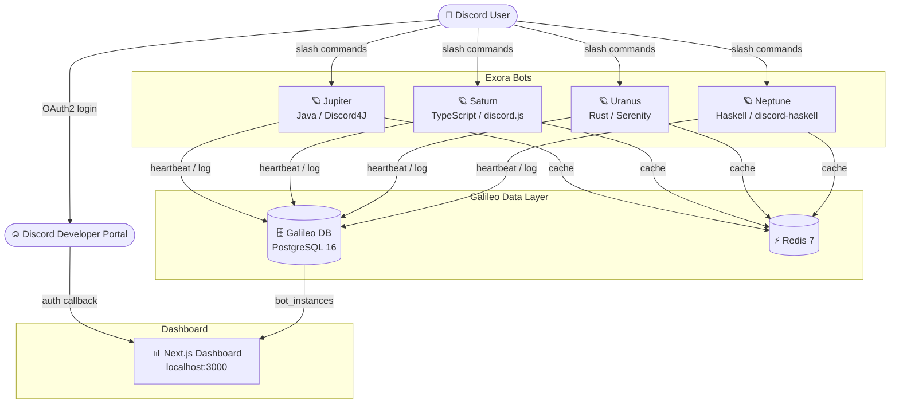
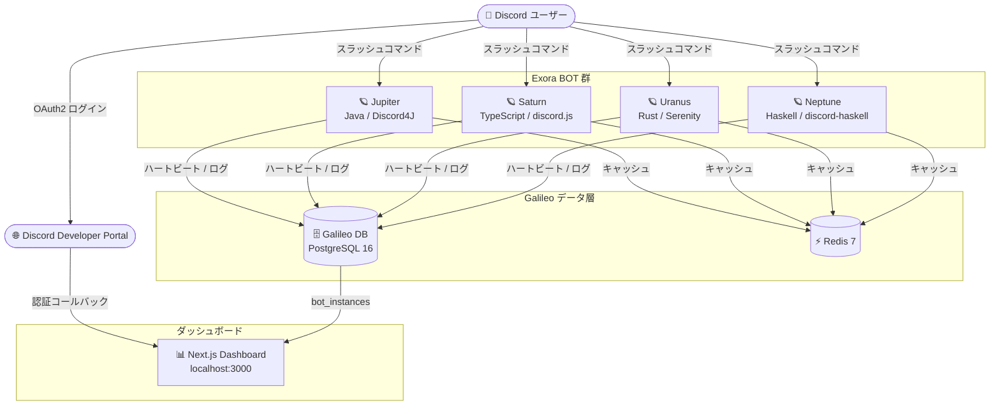

# Exora Project

> **日本語は後半のセクションをご覧ください。**

Exora Project is a monorepo for a four-bot Discord system with a shared data core (Galileo).

## Architecture

| Service    | Language / Framework           | Role                   |
| ---------- | ------------------------------ | ---------------------- |
| Jupiter    | Java 21 / Discord4J 3.2.6      | Bot #1                 |
| Saturn     | TypeScript / discord.js v14    | Bot #2                 |
| Uranus     | Rust / Serenity 0.12           | Bot #3                 |
| Neptune    | Haskell / discord-haskell 1.18 | Bot #4                 |
| Galileo DB | PostgreSQL 16                  | Shared data store      |
| Cache      | Redis 7                        | Sync cache             |
| Dashboard  | Next.js 14 / TypeScript        | Status & observability |



## Repository layout

```text
exora-project/
├── apps/
│   ├── bots/
│   │   ├── jupiter/   # Java bot
│   │   ├── saturn/    # TypeScript bot
│   │   ├── uranus/    # Rust bot
│   │   └── neptune/   # Haskell bot
│   └── dashboard/
│       └── web-ui/    # Next.js dashboard
├── data/
│   ├── galileo-db/migrations/
│   └── redis/
├── docs/              # Design docs & manuals
├── shared/
│   ├── assets/
│   └── proto/
├── .env.example
├── .gitignore
└── docker-compose.yml
```

## Quick start (Docker)

### Prerequisites

- Docker Desktop 24+ (with Compose v2)
- Discord bot tokens for all four bots

### Steps

```bash
# 1. Copy and fill in environment variables
cp .env.example .env
# Edit .env and set all DISCORD_TOKEN_* values

# 2. Build and start all services
docker compose up -d --build

# 3. Check service health
docker compose ps

# 4. Tail logs
docker compose logs -f jupiter saturn uranus neptune dashboard
```

Dashboard is available at **http://localhost:3000** once all services are up.

For detailed startup instructions see [docs/docker-startup.md](docs/docker-startup.md).

## Security rules

- Never commit `.env`.
- Keep all secrets in environment variables.
- Rotate bot tokens regularly.
- Each bot uses its own Discord Application; the dashboard OAuth uses a dedicated 5th application.

---

# Exora Project（日本語）

Exora Project は、4つの Discord BOT と共有データコア（Galileo）で構成されるモノリポジトリです。

## アーキテクチャ

| サービス       | 言語 / フレームワーク          | 役割             |
| -------------- | ------------------------------ | ---------------- |
| Jupiter        | Java 21 / Discord4J 3.2.6      | BOT #1           |
| Saturn         | TypeScript / discord.js v14    | BOT #2           |
| Uranus         | Rust / Serenity 0.12           | BOT #3           |
| Neptune        | Haskell / discord-haskell 1.18 | BOT #4           |
| Galileo DB     | PostgreSQL 16                  | 共有データストア |
| キャッシュ     | Redis 7                        | 同期キャッシュ   |
| ダッシュボード | Next.js 14 / TypeScript        | ステータス監視   |



## クイックスタート（Docker）

```bash
# 1. 環境変数ファイルを作成
cp .env.example .env
# .env を編集して全 DISCORD_TOKEN_* を設定する

# 2. 全サービスをビルド・起動
docker compose up -d --build

# 3. サービス状態を確認
docker compose ps

# 4. ログを確認
docker compose logs -f jupiter saturn uranus neptune dashboard
```

ダッシュボードは起動後 **http://localhost:3000** で確認できます。

詳細な起動手順は [docs/docker-startup.md](docs/docker-startup.md) を参照してください。

## セキュリティルール

- `.env` は絶対にコミットしない。
- 全シークレットは環境変数で管理する。
- BOT トークンは定期的にローテーションする。
- 各 BOT は個別の Discord Application を使用し、ダッシュボード OAuth には専用の第5 Application を作成する。

## 現在のフェーズ

Phase 2 完了: 全 4 BOT が Docker 上で稼働中。`/ping`・`/info` スラッシュコマンドを実装済み。
